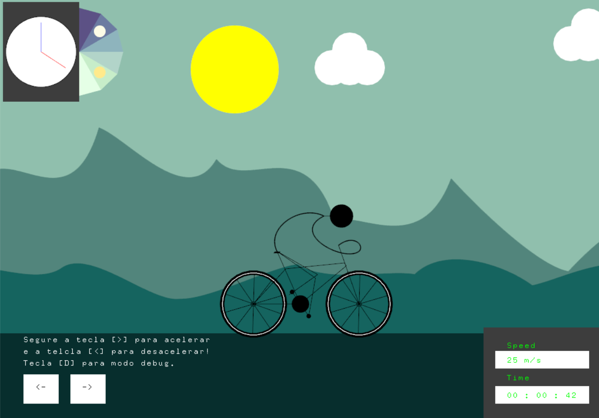

# Transformações geométricas

    

## Descrição:
O projeto é uma animação/jogo de um personagem andando de bicileta;

## Manual de Uso:
Basta abrir a plicação executar o main junto com as bibliotecas necessaria
para rodar o canvas2d. Use as setas esquerda e direita para acelerar e desacelerar
o ciclista e assim também acelerar e desacelerar a animação, a tecla "D" exibe o
mode debug que pode ser visualizado os pontos para gerar curvas e outras coisas.

## Implementações:

## Básico:
    [x] Desenho da bicicleta e personagem (utilizando-se de estruturas de classes).
    [X] Animação de pedalar com posicionamento correto das pernas e pedais, e correta rotação
    das rodas
    [x] Uso de matrizes de rotação e translação para posicionar os elementos de desenho na tela
    [X] Controle de FPS
## Extras:
    [X] Ligação matematicamente correta entre o pedal e a perna.
    [X] Utilizar curvas Bezier ou B-Spline para o desenho do personagem e montanhas.
    [X] Utilizar técnicas de parallax para desenhar um background com sensação de perspectiva
    conforme a bicicleta anda..
    [X] Utilizar concatenação de matrizes de transformação..
    [X] Acelerometro.
    [X] Relógio que não segue o tempo correto mas utiliza as técnicas de rotação e translação.

## Melhorias a fazer:
    [ ] Melhorar o relógio.
    [ ] Fazer um chão e bicicleta acompanhar os desniveis.
    [ ] Dar uma estudada de como suavizar as conexões de curvas de Bezier e B-Spline.

Obs: As montanhas foram feitas para ficar a forma mais caricata possivel então elas devem ser todas tortas
e não suavizadas.
